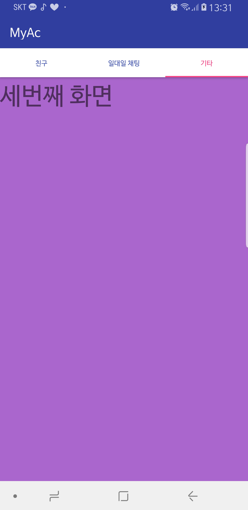

액션바 직접 만들기
========================

먼저 액션바를 없앤다. 

style -> No ActionBar

외부 라이브러리 추가

File -> project structure -> Dependencies -> +버튼 -> support에서 design 추가후 OK

보면 버전 충돌이 일어날 수 있다 .

Gradle Scripts 에서 build.gradle 에 들어가서  dependencies 부분을 보면 동영상 강의는 compile 이라고 되어있고 실제는 implementation이라고 되어 있는데
거기서 com.android.support:diesign:27.1.1 을 27.+ 이런 식으로 고쳐주면 뒤의 버전은 알아서 찾아주어서 신경쓸 일이 적어진다. (안해도 잘되긴함)

아래 빈공간에 들어갈 Fragment를 만들 것 

프래그먼트 xml 세개 만들고 

new class 한다음 수퍼클래스로 프래그먼트 

