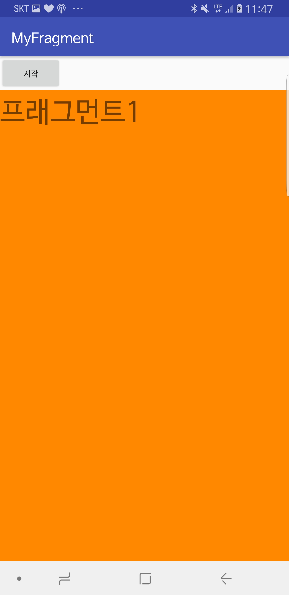
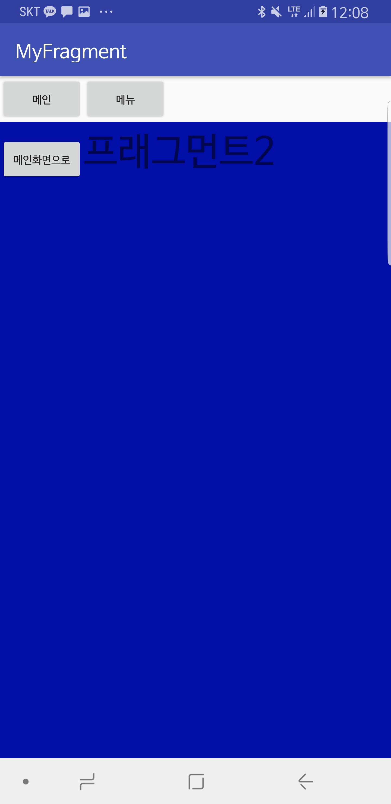

Fragment
=============

태블릿과 같이 큰 화면에서는 한 화면에 여러 부분화면을 넣는 것이 효율적

화면전환 하려면 원래 액티비티 전환을 해야 하는데 같은 기능을 가지고 두개를 만드는 건 비효율 적.

프래그먼트를 통해서 독립적으로 효율적으로 표현 가능. 코드는 좀 복잡해서 엄청 많이는 쓰이지 않는다. 

------

액티비티는 안드로이드 시스템에서 액티비티 매니저가 관리해준다. 인덴트로 

이러한 역할을 하는 프래그먼트 매니저가 필요하다. 

프래그먼트도 XML 파일 하나와 자바 소스파일 하나로 만들어진다.

------

슈퍼클래스로 Fragment를 상속받아야 하는데 그냥 Fragment 랑 이전 버전에서도 사용할 수 있게 해주는 support Fragment가 있는데 후자 선택

프래그먼트 추가하는 방법은 2가지 

	1. xml을 이용해서
	2. 자바 소스코드를 이용해서.

	
	

