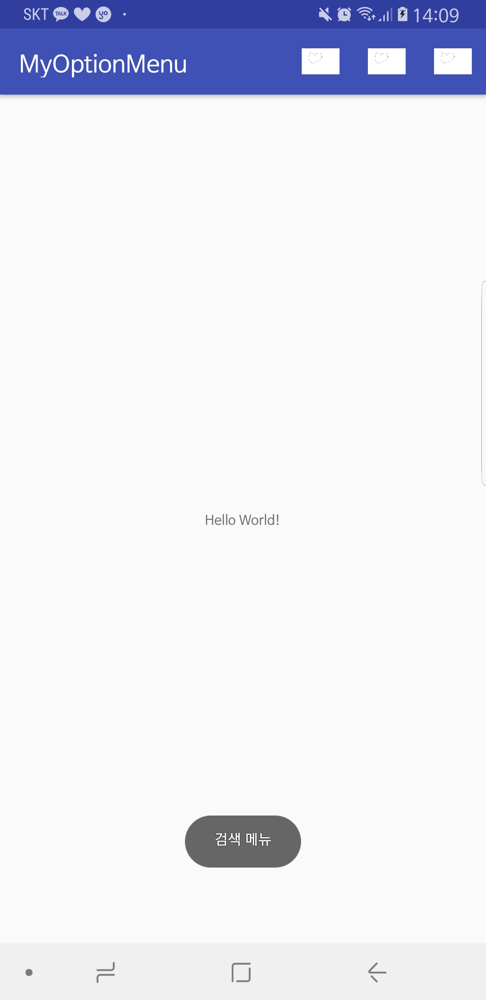

메뉴와 액션바
--------

메뉴만 따로 xml 파일을 만들어 줄 수 있다.

res 항목에서 새로 폴더를 만든다.

만든 폴더에서 오른쪽 클릭, menu resource file 만들기 클릭

만든 file에 

app이 빨간색이 뜬다면 빨간색 app에 커서 갖다대고 알트 엔터

/'
<?xml version="1.0" encoding="utf-8"?>
<menu xmlns:android="http://schemas.android.com/apk/res/android"
xmlns:app="http://schemas.android.com/apk/res-auto">
<item
android:id="@+id/menu_refresh"
android:title="새로고침"
android:icon="@drawable/a"
app:showAsAction="always"
/>
<item
android:id="@+id/menu_search"
android:title="검색" 
android:icon="@drawable/a"
app:showAsAction="always"
/>
<item
android:id="@+id/menu_settings"
android:title="설정"
android:icon="@drawable/a"
app:showAsAction="always"
/>
</menu>
'/

이렇게 작성했으면 등록해줘야한다. 

사용하고자 하는 화면의 자바파일에서

onCreateOptionsMenu

를 찾아 호출

/'
package com.example.pkiop.myoptionmenu;

import android.support.v7.app.AppCompatActivity;
import android.os.Bundle;
import android.view.Menu;

public class MainActivity extends AppCompatActivity {

@Override
protected void onCreate(Bundle savedInstanceState) {
super.onCreate(savedInstanceState);
setContentView(R.layout.activity_main);
}

@Override
public boolean onCreateOptionsMenu(Menu menu) {
getMenuInflater().inflate(R.menu.menu_main_xml,menu);
return true;
}
}

package com.example.pkiop.myoptionmenu;

import android.support.v7.app.AppCompatActivity;
import android.os.Bundle;
import android.view.Menu;
import android.view.MenuItem;
import android.widget.Toast;

public class MainActivity extends AppCompatActivity {

@Override
protected void onCreate(Bundle savedInstanceState) {
super.onCreate(savedInstanceState);
setContentView(R.layout.activity_main);
}

@Override
public boolean onCreateOptionsMenu(Menu menu) {
getMenuInflater().inflate(R.menu.menu_main_xml,menu);
return true;
}

@Override
public boolean onOptionsItemSelected(MenuItem item) {
int curId = item.getItemId();
switch(curId){
case R.id.menu_refresh:
Toast.makeText(this, "새로고침 메뉴 클릭됨.", Toast.LENGTH_LONG).show();
break;

case R.id.menu_search:
Toast.makeText(this,"검색 메뉴",Toast.LENGTH_LONG).show();
break;

case R.id.menu_settings:
Toast.makeText(this,"설정",Toast.LENGTH_LONG).show();
}

return super.onOptionsItemSelected(item);
}
}
'/

버튼 누르면 변화 

상단에 메뉴는 따로 설정을 안했는데 항상 보인다. 

위치는 res -> values -> styles.xml 

없애고 싶다면 그 styles에서 Light.DarkActionBar를 NoActionBar로 고치면 

다른 없애는 방법

/'
@Override
protected void onCreate(Bundle savedInstanceState) {
super.onCreate(savedInstanceState);
setContentView(R.layout.activity_main);
ActionBar abar = getSupportActionBar();
abar.hide();
}
'/

메뉴바 안에 아예 레이아웃을 집어넣을 수도 있다. 

부분화면 만들듯이

	
	

