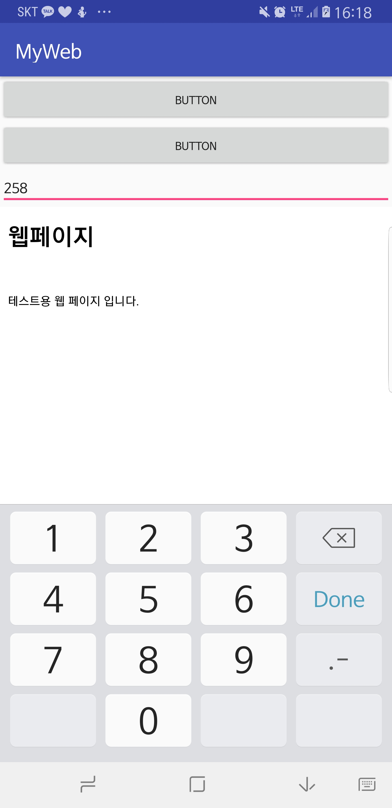

위젯 -> 웹뷰

=> 앱 안에 웹 브라우저가 들어갔다고 생각하면 된다 .

하다가 

1.프로젝트에서 app 오른쪽 클릭 -> new -> forder -> assert folder

인터넷 사용하게 하고 싶으면 

<uses-permission android:name="android.permission.INTERNET"/>

을 메니페스트파일에 추가 

edittext에서 어떤 키보드가 나올 지 선택가능

inputtype에서 선택
